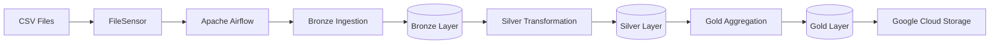
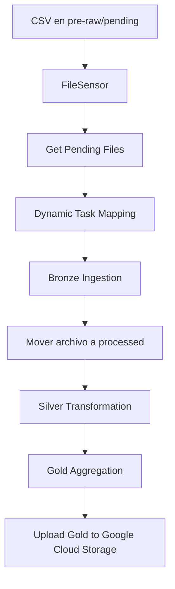

# 🚔 Chicago Crime Data Pipeline

<div align="center">


</div>

---

## 📖 Descripción

Este proyecto implementa un **pipeline de Ingeniería de Datos** completamente automatizado para el procesamiento del dataset **Crimes - 2001 to Present** de la ciudad de Chicago, compuesto por más de **8 millones de registros históricos**.

La solución utiliza una arquitectura **Medallion (Bronze → Silver → Gold)** para transformar datos crudos en conjuntos de datos listos para el análisis, integrando herramientas ampliamente utilizadas en la industria como **Apache Airflow**, **Apache Spark (PySpark)**, **Docker**, **PostgreSQL** y **Google Cloud Storage**.

El pipeline fue diseñado siguiendo un enfoque incremental, procesando únicamente los archivos nuevos mediante una **tabla de control**, evitando reprocesamientos innecesarios y reduciendo el tiempo de ejecución.

---

## 🎯 Objetivos del proyecto

Los principales objetivos de este proyecto son:

- Implementar un pipeline de datos completamente automatizado.
- Aplicar una arquitectura Medallion utilizando Apache Spark.
- Orquestar todas las etapas del proceso mediante Apache Airflow.
- Procesar únicamente nuevos archivos de manera incremental.
- Generar tablas analíticas optimizadas para consumo en herramientas de Business Intelligence.
- Publicar automáticamente la capa Gold en Google Cloud Storage.

---

## ✨ Características principales

✔ Procesamiento distribuido mediante Apache Spark.

✔ Orquestación completa utilizando Apache Airflow.

✔ Arquitectura Medallion.

✔ Procesamiento incremental.

✔ Dynamic Task Mapping.

✔ API REST personalizada para ejecutar Spark Jobs.

✔ Tabla de control para seguimiento del procesamiento.

✔ Publicación automática de resultados en Google Cloud Storage.

✔ Totalmente dockerizado mediante Docker Compose.

---

## 📊 Dataset

El proyecto utiliza el dataset público:

**Crimes - 2001 to Present**

Este conjunto de datos contiene información histórica de incidentes criminales reportados por el Departamento de Policía de Chicago desde el año 2001.

Características generales del dataset:

- Más de **8 millones de registros**.
- Más de **20 columnas**.
- Actualización periódica por parte de la ciudad de Chicago.
- Información geográfica.
- Información temporal.
- Tipo de delito.
- Arrestos.
- Delitos domésticos.
- Distrito policial.
- Comunidad.
- Coordenadas geográficas.

> ⚠️ Debido al tamaño del dataset, el archivo original no se encuentra incluido dentro del repositorio.

### 🔗 Fuente del dataset

Por restricciones de seguridad, no es posible compartir el enlace. Sin embargo, basta con buscar “chicago crime data 2001 to present” en Google; el primer resultado contiene el dataset.

---

## 📸 Vista general del proyecto

### Arquitectura

> 📷 **Insertar aquí una imagen de la arquitectura del proyecto.**

---

### Contenedores Docker

> 📷 **Insertar aquí una captura mostrando todos los contenedores ejecutándose.**

---

### DAG ejecutándose en Apache Airflow

> 📷 **Insertar aquí una captura del DAG en Graph View.**

---

### Google Cloud Storage

> 📷 **Insertar aquí una captura del bucket con la carpeta Gold.**

---

# 🏗️ Arquitectura del proyecto

El proyecto implementa una arquitectura de datos basada en el patrón **Medallion**, donde la información fluye de manera incremental a través de tres capas principales:

- **Bronze:** almacenamiento de los datos crudos.
- **Silver:** limpieza, estandarización y transformación de los datos.
- **Gold:** generación de tablas agregadas para análisis.

Todo el flujo es orquestado mediante **Apache Airflow**, mientras que el procesamiento distribuido es realizado por **Apache Spark**.

La ejecución de los procesos Spark se realiza mediante una **API REST personalizada** desplegada dentro del contenedor **Spark Master**, evitando instalar Spark en los contenedores de Airflow.

---

# 🏛️ Arquitectura general



---

# 🔄 Flujo de procesamiento



---

# 🛠️ Tecnologías utilizadas

| Tecnología | Uso dentro del proyecto |
|------------|-------------------------|
| Python 3.12 | Desarrollo del pipeline |
| Apache Spark 3.5.1 | Procesamiento distribuido |
| PySpark | Transformaciones de datos |
| Apache Airflow 2.10 | Orquestación |
| Docker | Contenedorización |
| Docker Compose | Levantamiento del entorno |
| PostgreSQL | Base de datos de Airflow |
| Google Cloud Storage | Almacenamiento de la capa Gold |
| Hadoop FileSystem API | Verificación de existencia de archivos y directorios |
| REST API | Ejecución remota de Spark Jobs |

---

# 📂 Estructura del proyecto

El repositorio contiene únicamente el código fuente y una pequeña muestra de datos para facilitar las pruebas.

```text
Chicago-Crime-Pipeline/
│
├── app/
│   ├── aggregation/
│   │   └── gold_aggregation.py
│   │
│   ├── ingestion/
│   │   └── bronze_ingestion.py
│   │
│   ├── transformation/
│   │   └── silver_transformation.py
│   │
│   └── spark_api.py
│
├── dags/
│   └── chicago_crime_orchestration.py
│
├── data/
│   ├── pre-raw/
│   │   ├── pending/
│   │   └── processed/
│   │
│   ├── bronze_level/
│   │
│   ├── silver_level/
│   │
│   ├── gold_level/
│   │
│   └── metadata/
│       └── table_control/
│
├── logs/
│
├── plugins/
│
├── docker-compose.yml
│
└── README.md
```

> 📷 **Insertar aquí una captura del árbol real del proyecto.**

---

# 📁 Organización de la carpeta `data`

Durante la ejecución del pipeline, la carpeta `data` almacena todas las capas de la arquitectura Medallion.

```text
data/

pre-raw/
│
├── pending/
│      Archivos CSV pendientes de procesar.
│
└── processed/
       Archivos CSV ya procesados por Bronze.

bronze_level/
│
└── Archivos Parquet particionados por Year.

silver_level/
│
└── Archivos Parquet transformados.

gold_level/
│
├── n_crimes_arrests_year/
├── n_indicators_day/
├── n_indicators_location/
└── ranking_year_primary_type/

metadata/
│
└── table_control/
```

La carpeta `metadata` contiene la tabla de control utilizada para conocer qué archivos ya fueron procesados por cada una de las capas del pipeline.

---

# 📋 Tabla de control

Uno de los componentes más importantes del proyecto es la **tabla de control**, utilizada para implementar un procesamiento incremental.

Cada archivo procesado genera un registro con el siguiente esquema:

| Columna | Descripción |
|----------|-------------|
| `file_source` | Nombre del archivo CSV procesado. |
| `status_bronze` | Indica si el archivo fue procesado por Bronze. |
| `status_silver` | Indica si el archivo fue procesado por Silver. |
| `status_gold` | Indica si el archivo ya fue considerado en Gold. |

Gracias a esta tabla:

- Bronze registra cada nuevo archivo procesado.
- Silver procesa únicamente archivos con `status_silver = False`.
- Gold actualiza el estado de los archivos una vez finaliza la agregación.

Este mecanismo evita reprocesar archivos ya tratados y mantiene un flujo incremental entre las distintas capas.

---

# 📷 Capturas recomendadas

Agregar las siguientes imágenes en esta sección:

- Arquitectura del proyecto.
- Árbol del proyecto.
- Estructura de la carpeta `data`.
- Contenido de la tabla de control después de ejecutar el DAG.
