# 🚔 Chicago Crime Data Pipeline

<div align="center">


</div>

---

## 📖 Descripción

Este proyecto implementa un **pipeline de Ingeniería de Datos** completamente automatizado para el procesamiento del dataset **Crimes - 2001 to Present** de la ciudad de Chicago, compuesto por más de **8 millones de registros históricos**.

La solución utiliza una arquitectura **Medallion (Bronze → Silver → Gold)** para transformar datos crudos en conjuntos de datos listos para el análisis, integrando herramientas ampliamente utilizadas en la industria como **Apache Airflow**, **Apache Spark (PySpark)**, **Docker**, **PostgreSQL** y **Google Cloud Storage**.

El pipeline fue diseñado siguiendo un enfoque incremental, procesando únicamente los archivos nuevos mediante una **tabla de control**, evitando reprocesamientos innecesarios y reduciendo el tiempo de ejecución.

---

## 🎯 Objetivos del proyecto

Los principales objetivos de este proyecto son:

- Implementar un pipeline de datos completamente automatizado.
- Aplicar una arquitectura Medallion utilizando Apache Spark.
- Orquestar todas las etapas del proceso mediante Apache Airflow.
- Procesar únicamente nuevos archivos de manera incremental.
- Generar tablas analíticas optimizadas para consumo en herramientas de Business Intelligence.
- Publicar automáticamente la capa Gold en Google Cloud Storage.

---

## ✨ Características principales

✔ Procesamiento distribuido mediante Apache Spark.

✔ Orquestación completa utilizando Apache Airflow.

✔ Arquitectura Medallion.

✔ Procesamiento incremental.

✔ Dynamic Task Mapping.

✔ API REST personalizada para ejecutar Spark Jobs.

✔ Tabla de control para seguimiento del procesamiento.

✔ Publicación automática de resultados en Google Cloud Storage.

✔ Totalmente dockerizado mediante Docker Compose.

---

## 📊 Dataset

El proyecto utiliza el dataset público:

**Crimes - 2001 to Present**

Este conjunto de datos contiene información histórica de incidentes criminales reportados por la ciudad de Chicago desde el año 2001.

Características generales del dataset:

- Más de **8 millones de registros**.
- Más de **20 columnas**.
- Actualización periódica por parte de la ciudad de Chicago.
- Información geográfica.
- Información temporal.
- Tipo de delito.
- Arrestos.
- Delitos domésticos.
- Distrito policial.
- Comunidad.
- Coordenadas geográficas.

> ⚠️ Debido al tamaño del dataset, el archivo original no se encuentra incluido dentro del repositorio.

### 🔗 Fuente del dataset

Por restricciones de seguridad, no es posible compartir el enlace. Sin embargo, basta con buscar “chicago crime data 2001 to present” en Google; el primer resultado contiene el dataset.

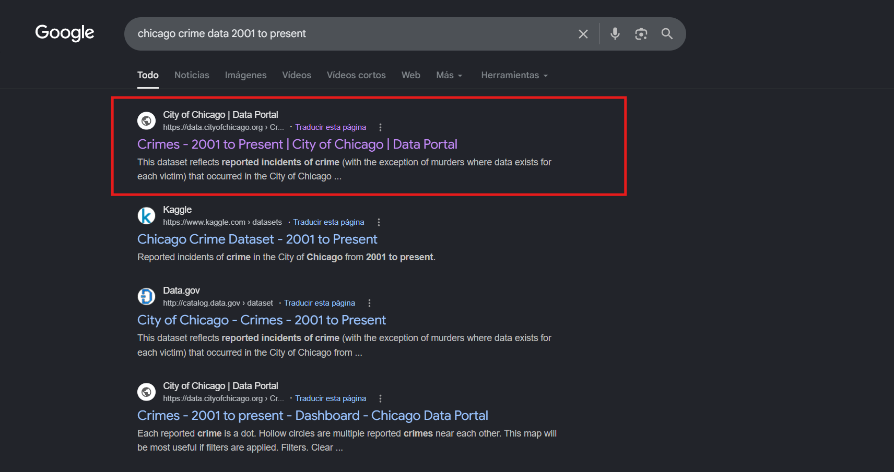

---

## 📸 Vista general del proyecto

### Arquitectura

> 📷 **Insertar aquí una imagen de la arquitectura del proyecto.**

---

### Contenedores Docker

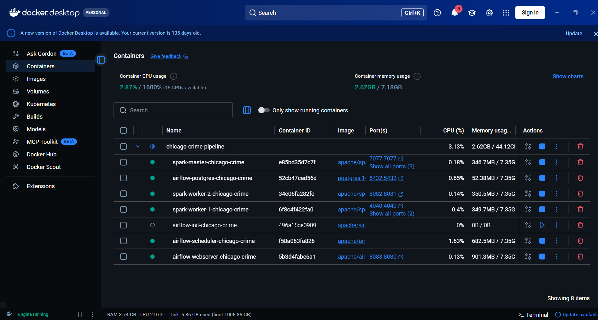

---

### DAG ejecutándose en Apache Airflow

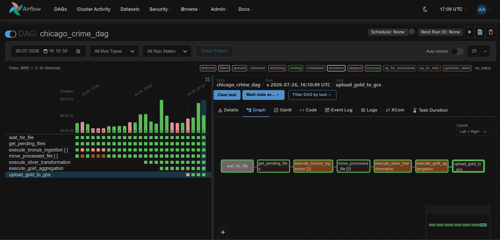

---

### Google Cloud Storage

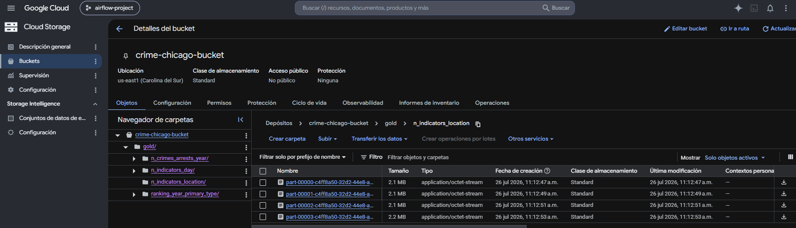

---

# 🏗️ Arquitectura del proyecto

El proyecto implementa una arquitectura de datos basada en el patrón **Medallion**, donde la información fluye de manera incremental a través de tres capas principales:

- **Bronze:** almacenamiento de los datos crudos.
- **Silver:** limpieza, estandarización y transformación de los datos.
- **Gold:** generación de tablas agregadas para análisis.

Todo el flujo es orquestado mediante **Apache Airflow**, mientras que el procesamiento distribuido es realizado por **Apache Spark**.

La ejecución de los procesos Spark se realiza mediante una **API REST personalizada** desplegada dentro del contenedor **Spark Master**, evitando instalar Spark en los contenedores de Airflow.

---

# 🏛️ Arquitectura general

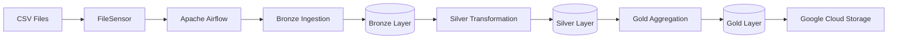

---

# 🔄 Flujo de procesamiento

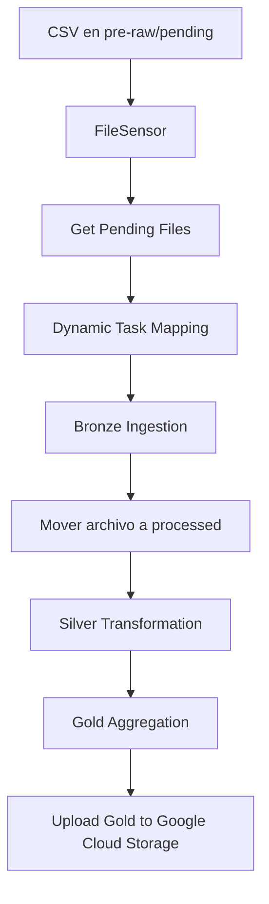

---

# 🛠️ Tecnologías utilizadas

| Tecnología | Uso dentro del proyecto |
|------------|-------------------------|
| Python 3.12 | Desarrollo del pipeline |
| Apache Spark 3.5.1 | Procesamiento distribuido |
| PySpark | Transformaciones de datos |
| Apache Airflow 2.10 | Orquestación |
| Docker | Contenedorización |
| Docker Compose | Levantamiento del entorno |
| PostgreSQL | Base de datos de Airflow |
| Google Cloud Storage | Almacenamiento de la capa Gold |
| Hadoop FileSystem API | Verificación de existencia de archivos y directorios |
| REST API | Ejecución remota de Spark Jobs |

---

# 📂 Estructura del proyecto

El repositorio contiene únicamente el código fuente y una pequeña muestra de datos para facilitar las pruebas.

```text
Chicago-Crime-Pipeline/
│
├── app/
│   ├── aggregation/
│   │   └── gold_aggregation.py
│   │
│   ├── ingestion/
│   │   └── bronze_ingestion.py
│   │
│   ├── transformation/
│   │   └── silver_transformation.py
│   │
│   └── spark_api.py
│
├── dags/
│   └── chicago_crime_orchestration.py
│
├── data/
│   ├── pre-raw/
│   │   ├── pending/
│   │   └── processed/
│   │
│   ├── bronze_level/
│   │
│   ├── silver_level/
│   │
│   ├── gold_level/
│   │
│   └── metadata/
│       └── table_control/
│
├── logs/
│
├── plugins/
│
├── docker-compose.yml
│
└── README.md
```

---

# 📁 Organización de la carpeta `data`

Durante la ejecución del pipeline, la carpeta `data` almacena todas las capas de la arquitectura Medallion.

```text
data/

pre-raw/
│
├── pending/
│      Archivos CSV pendientes de procesar.
│
└── processed/
       Archivos CSV ya procesados por Bronze.

bronze_level/
│
└── Archivos Parquet particionados por Year.

silver_level/
│
└── Archivos Parquet transformados.

gold_level/
│
├── n_crimes_arrests_year/
├── n_indicators_day/
├── n_indicators_location/
└── ranking_year_primary_type/

metadata/
│
└── table_control/
```

La carpeta `metadata` contiene la tabla de control utilizada para conocer qué archivos ya fueron procesados por cada una de las capas del pipeline.

---

# 📋 Tabla de control

Uno de los componentes más importantes del proyecto es la **tabla de control**, utilizada para implementar un procesamiento incremental.

Cada archivo procesado genera un registro con el siguiente esquema:

| Columna | Descripción |
|----------|-------------|
| `file_source` | Nombre del archivo CSV procesado. |
| `status_bronze` | Indica si el archivo fue procesado por Bronze. |
| `status_silver` | Indica si el archivo fue procesado por Silver. |
| `status_gold` | Indica si el archivo ya fue considerado en Gold. |

Gracias a esta tabla:

- Bronze registra cada nuevo archivo procesado.
- Silver procesa únicamente archivos con `status_silver = False`.
- Gold actualiza el estado de los archivos una vez finaliza la agregación.

Este mecanismo evita reprocesar archivos ya tratados y mantiene un flujo incremental entre las distintas capas.

---

# 🥉 Capa Bronze

## Objetivo

La capa **Bronze** constituye el punto de entrada de los datos dentro de la arquitectura Medallion.

Su objetivo es almacenar los datos prácticamente en su estado original, realizando únicamente aquellas transformaciones necesarias para facilitar el procesamiento de las siguientes capas.

En este proyecto la capa Bronze es responsable de:

- Leer los archivos CSV originales.
- Aplicar un esquema (`Schema`) definido manualmente.
- Incorporar columnas de metadatos.
- Almacenar la información en formato Parquet.
- Particionar los datos por año (`Year`).
- Registrar el archivo procesado en la tabla de control.

La implementación de esta capa se encuentra en:

```text
app/
└── ingestion/
    └── bronze_ingestion.py
```

---

# Flujo de la capa Bronze

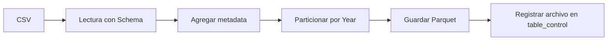

---

# Lectura de datos

En lugar de permitir que Spark infiera automáticamente el tipo de cada columna, el proyecto define explícitamente un **Schema** mediante `StructType`.

```python
spark.read \
    .option("header", "true") \
    .schema(schema_chicago_crime) \
    .csv(...)
```

Esta estrategia ofrece varias ventajas:

- Evita errores de inferencia de tipos.
- Reduce el tiempo de lectura.
- Mantiene un esquema consistente entre ejecuciones.
- Facilita el mantenimiento del pipeline.

---

# Esquema de datos

El dataset contiene información relacionada con delitos ocurridos en la ciudad de Chicago.

Algunas de las columnas más relevantes son:

| Columna | Descripción |
|----------|-------------|
| ID | Identificador único del crimen |
| Case Number | Número del caso |
| Date | Fecha del incidente |
| Block | Dirección aproximada |
| Primary Type | Tipo principal del delito |
| Description | Descripción del delito |
| Arrest | Indica si hubo arresto |
| Domestic | Delito doméstico |
| Beat | Beat policial |
| District | Distrito policial |
| Ward | Distrito administrativo |
| Community Area | Comunidad |
| Latitude | Latitud |
| Longitude | Longitud |
| Year | Año del incidente |

---

# Incorporación de metadatos

Después de leer el archivo se agregan dos columnas adicionales.

## ingestion_date

Registra la fecha y hora exacta en la que el registro fue incorporado al Data Lake.

```python
current_timestamp()
```

Esta columna permite:

- Auditoría.
- Trazabilidad.
- Seguimiento de cargas.

---

## file_source

Registra el nombre del archivo desde el cual proviene cada registro.

```python
file_source = path_file.name
```

Gracias a esta columna las capas posteriores pueden identificar qué registros pertenecen a cada archivo procesado.

Esta decisión resulta fundamental para implementar el procesamiento incremental.

---

# Escritura de datos

Una vez agregados los metadatos, la información se almacena en formato **Parquet**.

```python
bronze_df.write \
    .mode("append") \
    .partitionBy("Year") \
    .parquet(path_destination)
```

El modo de escritura utilizado es:

```text
append
```

Esto permite incorporar nuevos archivos sin reemplazar la información previamente almacenada.

---

# Particionamiento

Los datos son particionados únicamente por la columna:

```text
Year
```

La estructura generada es similar a la siguiente:

```text
bronze_level/

Year=2001/
Year=2002/
Year=2003/
...
Year=2025/
```

Cada carpeta contiene uno o varios archivos Parquet generados por Spark.

Esta estrategia reduce significativamente la cantidad de datos leídos cuando las consultas filtran por año.

---

# Registro en la tabla de control

Al finalizar el procesamiento se registra el archivo procesado dentro de la tabla de control.

Se agrega un registro con la siguiente información:

| Campo | Valor inicial |
|--------|---------------|
| file_source | Nombre del archivo CSV |
| status_bronze | True |
| status_silver | False |
| status_gold | False |

De esta forma la siguiente capa conoce exactamente qué archivos aún no han sido procesados.

---

# Resultado de la capa Bronze

Al finalizar la ejecución se generan dos salidas.

## Datos

```text
data/

bronze_level/

Year=2001/
Year=2002/
...
```

---

## Metadata

```text
metadata/

table_control/
```

---

# Consideraciones de diseño

Se decidió particionar únicamente por el campo **Year**, ya que representa una dimensión temporal ampliamente utilizada para consultas analíticas y evita generar un número excesivo de particiones pequeñas.

Asimismo, el uso del modo **append** permite incorporar nuevos archivos sin sobrescribir la información previamente almacenada, manteniendo el historial completo de los datos ingeridos.

Finalmente, la incorporación de una tabla de control desacopla el procesamiento entre las distintas capas del pipeline, permitiendo que Silver procese únicamente los archivos pendientes sin necesidad de mover o eliminar los datos almacenados en Bronze.

# 🥈 Capa Silver

## Objetivo

La capa **Silver** tiene como objetivo transformar los datos provenientes de la capa Bronze en un conjunto de datos limpio, estandarizado y consistente, listo para ser utilizado en procesos analíticos.

A diferencia de la capa Bronze, aquí sí se aplican reglas de calidad de datos, normalización y enriquecimiento de la información.

La implementación de esta capa se encuentra en:

```text
app/
└── transformation/
    └── silver_transformation.py
```

---

# Flujo de la capa Silver

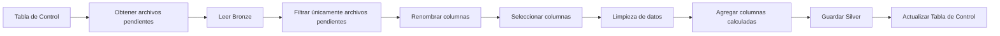

---

# Procesamiento incremental

Antes de leer la capa Bronze, el proceso consulta la tabla de control para identificar qué archivos aún no han sido procesados.

```python
status_silver == False
```

Si no existen archivos pendientes, el proceso finaliza lanzando la excepción:

```text
There are no files to process.
```

Con esta estrategia se evita volver a transformar archivos ya procesados.

---

# Lectura de datos

Una vez identificados los archivos pendientes, se realiza la lectura de toda la capa Bronze.

Posteriormente, se ejecuta un **Broadcast Join** con la tabla de control para conservar únicamente los registros pertenecientes a los archivos pendientes.

```python
join(
    broadcast(df_table_control.select("file_source")),
    on="file_source",
    how="inner"
)
```

El uso de `broadcast()` evita un Shuffle innecesario y mejora considerablemente el rendimiento debido al reducido tamaño de la tabla de control.

---

# Renombrado de columnas

Con el objetivo de mantener una nomenclatura uniforme y facilitar futuras consultas SQL, todas las columnas son convertidas al formato:

```text
snake_case
```

Por ejemplo:

| Bronze | Silver |
|---------|---------|
| ID | id |
| Case Number | case_number |
| Primary Type | primary_type |
| Community Area | community_area |
| Updated On | updated_on |

Este cambio mejora la legibilidad del código y sigue una convención ampliamente utilizada en proyectos de Ingeniería de Datos.

---

# Selección de columnas

Después del renombrado se conservan únicamente las columnas relevantes para el análisis.

Entre ellas:

- file_source
- id
- date
- block
- primary_type
- description
- arrest
- domestic
- beat
- district
- ward
- community_area
- latitude
- longitude
- year

Eliminar columnas innecesarias reduce el tamaño de almacenamiento y mejora el rendimiento de las consultas posteriores.

---

# Eliminación de registros duplicados

La capa Silver elimina posibles registros duplicados utilizando el identificador único del delito.

```python
dropDuplicates(["id"])
```

Con ello se garantiza que cada crimen aparezca una única vez dentro del conjunto de datos.

---

# Conversión del tipo de dato Date

En Bronze la columna **Date** permanece como texto.

En Silver se transforma al tipo de dato `Date`.

```python
to_date(
    col("date"),
    "MM/dd/yyyy hh:mm:ss a"
)
```

Esto permite realizar posteriormente filtros, agrupaciones y funciones temporales de manera eficiente.

---

# Tratamiento de valores nulos

Se eliminan los registros cuya fecha sea nula.

Además, también se descartan registros cuando todas las siguientes columnas son simultáneamente nulas:

- block
- primary_type
- description
- arrest
- domestic

Esta validación conserva únicamente registros con información mínima útil para el análisis.

---

# Limpieza de texto

Las columnas de texto son normalizadas mediante dos transformaciones.

## Eliminación de espacios

Se eliminan:

- espacios al inicio;
- espacios al final;
- múltiples espacios consecutivos.

```python
trim()

regexp_replace()
```

Ejemplo:

Antes

```text
"  MOTOR    VEHICLE   THEFT "
```

Después

```text
"MOTOR VEHICLE THEFT"
```

---

# Capitalización

Posteriormente algunas columnas son convertidas utilizando:

```python
initcap()
```

Ejemplo

Antes

```text
MOTOR VEHICLE THEFT
```

Después

```text
Motor Vehicle Theft
```

Las columnas transformadas son:

- primary_type
- description

Con ello se mejora la presentación de la información para futuros dashboards y reportes.

---

# Enriquecimiento de datos

Se incorpora una nueva columna:

```text
day_name_of_week
```

La cual representa el nombre del día de la semana obtenido a partir de la fecha del incidente.

```python
date_format(
    col("date"),
    "EEEE"
)
```

Esta columna permite generar análisis temporales sin necesidad de recalcularla posteriormente.

---

# Metadatos

Antes de escribir la información se agrega nuevamente la columna:

```text
ingestion_date
```

Esta columna registra cuándo la información fue transformada dentro de la capa Silver.

---

# Escritura de datos

Los datos transformados se almacenan nuevamente en formato Parquet.

```python
mode("append")
```

y se mantienen particionados por:

```text
Year
```

Conservar la misma estrategia de particionamiento simplifica el procesamiento posterior de la capa Gold.

---

# Actualización de la tabla de control

Una vez finalizada la transformación, se obtienen los archivos procesados.

```python
select("file_source").distinct()
```

Posteriormente se actualiza el estado:

```text
status_silver = True
```

Finalmente la tabla de control se sobrescribe con la información actualizada.

De esta manera Bronze nunca volverá a enviar esos archivos para ser transformados.

---

# Resultado de la capa Silver

Al finalizar el proceso se obtiene:

```text
silver_level/

Year=2001/
Year=2002/
Year=2003/
...
```

junto con una tabla de control actualizada.

---

# Consideraciones de diseño

La lógica implementada en Silver sigue un enfoque incremental apoyado en una tabla de control, evitando reprocesamientos innecesarios.

El uso de un **Broadcast Join** reduce el costo de filtrar únicamente los archivos pendientes, mientras que las transformaciones aplicadas garantizan que los datos lleguen a la capa Gold con un formato consistente y listo para generar indicadores agregados.

Asimismo, mantener el particionamiento por `Year` permite conservar una organización uniforme de los datos entre Bronze y Silver, facilitando futuras consultas y optimizando la lectura de información histórica.

# 🥇 Capa Gold

## Objetivo

La capa **Gold** representa el nivel de consumo del Data Lake.

En esta capa los datos transformados de Silver se convierten en tablas agregadas listas para ser consumidas por herramientas de Business Intelligence, dashboards o procesos analíticos.

La implementación se encuentra en:

```text
app/
└── aggregation/
    └── gold_aggregation.py
```

---

# Flujo de la capa Gold

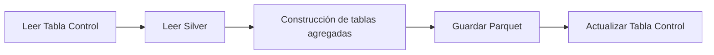

---

# Lectura de datos

La capa Gold comienza leyendo dos fuentes de información.

## Tabla de control

```text
metadata/table_control
```

Esta tabla será utilizada posteriormente para actualizar el estado de los archivos ya procesados.

---

## Capa Silver

```text
silver_level/
```

Todos los registros transformados son utilizados para construir los indicadores analíticos.

---

# Tabla 1 - Número de crímenes y arrestos por tipo de delito

La primera agregación calcula el número de delitos y arrestos agrupando por:

- Año
- Tipo principal del delito
- Descripción del delito

```python
groupBy(
    "year",
    "primary_type",
    "description"
)
```

Se generan los siguientes indicadores:

| Columna | Descripción |
|----------|-------------|
| number_of_crimes | Número total de delitos |
| number_of_arrests | Número total de arrestos |

Para calcular los arrestos se convierte el campo booleano a entero.

```python
sum(
    arrest.cast("int")
)
```

De esta forma:

```text
True  -> 1

False -> 0
```

La suma representa directamente la cantidad de arrestos.

---

# Tabla 2 - Indicadores por día de la semana

La segunda tabla resume la información por:

- Año
- Día de la semana

```python
groupBy(
    "year",
    "day_name_of_week"
)
```

Se calculan tres indicadores:

- Número de delitos.
- Número de arrestos.
- Número de delitos domésticos.

Esta tabla resulta especialmente útil para construir gráficos temporales y detectar patrones semanales.

---

# Tabla 3 - Indicadores geográficos

La tercera tabla agrega la información según la ubicación donde ocurrió el delito.

Las dimensiones utilizadas son:

- community_area
- ward
- district
- beat
- block

Para cada combinación se calculan:

- Número de delitos.
- Número de arrestos.
- Número de delitos domésticos.

Esta información permite desarrollar mapas, análisis geográficos y estudios de concentración del crimen.

---

# Tabla 4 - Ranking de delitos por año

La cuarta tabla genera un ranking del tipo de delito con menor incidencia para cada año.

Primero se calcula el número de delitos por:

```python
groupBy(
    "year",
    "primary_type"
)
```

Posteriormente se define una función de ventana.

```python
Window
.partitionBy("year")
.orderBy(
    asc("number_of_crimes")
)
```

La ventana reinicia el cálculo para cada año y ordena los delitos desde el menor número de ocurrencias hacia el mayor.

Finalmente se aplica:

```python
dense_rank()
```

obteniendo un ranking como el siguiente.

| Year | Primary Type | Crimes | Ranking |
|------|--------------|--------|---------|
|2020|Homicide|120|1|
|2020|Kidnapping|165|2|
|2020|Arson|240|3|

Al utilizar **Dense Rank**, si existen empates ambos registros reciben el mismo ranking y no se generan saltos en la numeración.

---

# Escritura de resultados

Cada tabla agregada se almacena de manera independiente.

```text
gold_level/

n_crimes_arrests_year/

n_indicators_day/

n_indicators_location/

ranking_year_primary_type/
```

Todas las tablas son escritas utilizando:

```python
mode("overwrite")
```

Esto garantiza que cada ejecución reconstruya completamente los indicadores analíticos a partir de la información disponible en Silver.

---

# Actualización de la tabla de control

Una vez generadas todas las tablas agregadas, la tabla de control es actualizada.

El proceso establece:

```text
status_gold = True
```

para todos los archivos registrados.

Para evitar inconsistencias durante la escritura, la actualización se realiza mediante el siguiente procedimiento:

1. Crear una tabla temporal.
2. Escribir la información actualizada.
3. Eliminar la tabla original.
4. Renombrar la tabla temporal con el nombre definitivo.

Esta estrategia evita dejar una tabla parcialmente escrita en caso de que ocurra un error durante el proceso.

---

# Resultado de la capa Gold

La estructura final es la siguiente.

```text
gold_level/

├── n_crimes_arrests_year/

├── n_indicators_day/

├── n_indicators_location/

└── ranking_year_primary_type/
```

Cada carpeta contiene archivos Parquet listos para ser consumidos por herramientas analíticas.

---

# Indicadores generados

El pipeline produce actualmente cuatro conjuntos de indicadores.

| Tabla | Descripción |
|---------|------------|
| n_crimes_arrests_year | Número de delitos y arrestos por año, tipo y descripción. |
| n_indicators_day | Delitos, arrestos y delitos domésticos por día de la semana. |
| n_indicators_location | Indicadores geográficos por comunidad, distrito, beat y bloque. |
| ranking_year_primary_type | Ranking anual de los delitos con menor incidencia. |

---

# Consideraciones de diseño

La capa Gold concentra la lógica analítica del proyecto y genera datasets optimizados para consulta, evitando que las herramientas de visualización deban ejecutar agregaciones complejas sobre millones de registros.

Cada tabla se almacena de forma independiente, permitiendo que los consumidores accedan únicamente a la información necesaria según su caso de uso.

La utilización de funciones de ventana (`Window` + `dense_rank`) demuestra el uso de capacidades avanzadas de Spark para construir indicadores analíticos sin necesidad de procesos adicionales.

# 🌬️ Orquestación con Apache Airflow

## Objetivo

Apache Airflow es el encargado de automatizar todo el pipeline de procesamiento.

Cada vez que llegan nuevos archivos CSV a la carpeta `pre-raw/pending`, Airflow ejecuta automáticamente las distintas capas de la arquitectura Medallion hasta publicar los resultados finales en Google Cloud Storage.

La implementación del DAG se encuentra en:

```text
dags/
└── chicago_crime_orchestration.py
```

---

# Flujo general del DAG

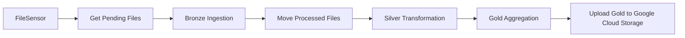

---

# Programación del DAG

Durante el desarrollo del proyecto el DAG se encuentra configurado con:

```python
schedule = None
```

Esto permite ejecutar manualmente el pipeline y facilitar las pruebas de cada una de las etapas.

En un entorno productivo, el DAG será programado para ejecutarse diariamente a las **09:00 AM**.

```python
schedule = "0 9 * * *"
```

---

# Tarea 1 - FileSensor

La primera tarea del DAG utiliza un **FileSensor** para detectar automáticamente la llegada de nuevos archivos CSV.

```python
FileSensor(
    fs_conn_id="pre_raw_fs",
    filepath="pending/*.csv"
)
```

El sensor permanece esperando hasta encontrar al menos un archivo dentro de:

```text
pre-raw/

└── pending/
```

Este enfoque evita ejecutar el pipeline cuando no existen datos nuevos para procesar.

---

# Tarea 2 - Obtener archivos pendientes

Una vez detectada la existencia de archivos, se obtiene dinámicamente la lista completa de archivos CSV presentes en la carpeta.

```python
glob("*.csv")
```

La tarea retorna una lista similar a:

```python
[
    "/opt/data/pre-raw/pending/file_01.csv",
    "/opt/data/pre-raw/pending/file_02.csv",
    "/opt/data/pre-raw/pending/file_03.csv"
]
```

Esta lista será utilizada posteriormente para generar tareas dinámicas.

---

# Tarea 3 - Bronze Ingestion (Dynamic Task Mapping)

Uno de los aspectos más importantes del proyecto es la utilización de **Dynamic Task Mapping**.

En lugar de procesar todos los archivos dentro de una única tarea, Airflow crea automáticamente una tarea independiente para cada archivo detectado.

Por ejemplo, si existen tres archivos:

```text
crime_2023.csv

crime_2024.csv

crime_2025.csv
```

Airflow generará automáticamente:

```text
execute_bronze_ingestion[0]

execute_bronze_ingestion[1]

execute_bronze_ingestion[2]
```

Cada tarea envía una solicitud HTTP hacia la API desplegada en el Spark Master.

```json
{
    "input_file": "...",
    "phase": "bronze"
}
```

De esta manera cada archivo es procesado de forma independiente.

---

# Comunicación mediante API REST

Airflow no ejecuta directamente `spark-submit`.

En su lugar, utiliza un `HttpOperator` para enviar solicitudes HTTP a una API personalizada implementada en el contenedor Spark Master.

```text
Airflow

↓

POST /submit

↓

Spark API

↓

spark-submit

↓

Apache Spark
```

Este diseño desacopla Airflow del entorno Spark y evita instalar Spark dentro de los contenedores de Airflow.

---

# Spark API

La API fue desarrollada utilizando el módulo estándar de Python:

```python
http.server
```

El endpoint disponible es:

```text
POST

/submit
```

Cada solicitud contiene dos parámetros:

```json
{
    "input_file": "...",
    "phase": "bronze"
}
```

Dependiendo del valor de `phase`, la API ejecuta uno de los siguientes procesos:

| Phase | Script ejecutado |
|--------|------------------|
| bronze | bronze_ingestion.py |
| silver | silver_transformation.py |
| gold | gold_aggregation.py |

Internamente la API ejecuta:

```bash
spark-submit
```

utilizando `subprocess.run()`.

---

# Respuesta de la API

Una vez finalizada la ejecución de Spark, la API devuelve una respuesta JSON.

Ejemplo de éxito:

```json
{
    "status": "SUCCESS",
    "input_file": "crime_2025.csv"
}
```

En caso de error se devuelve el mensaje generado por Spark.

Esta respuesta es utilizada por Airflow para determinar si la siguiente tarea puede continuar.

---

# Tarea 4 - Mover archivos procesados

Después de finalizar correctamente Bronze, el archivo CSV original es movido desde:

```text
pre-raw/pending/
```

hacia:

```text
pre-raw/processed/
```

Este movimiento evita volver a detectar el mismo archivo en futuras ejecuciones del DAG.

Cada tarea dinámica mueve únicamente el archivo que acaba de procesar.

---

# Tarea 5 - Silver Transformation

Una vez que todos los archivos fueron procesados por Bronze y movidos a la carpeta `processed`, Airflow ejecuta una única tarea correspondiente a la transformación Silver.

La solicitud enviada a la API es:

```json
{
    "input_file": "",
    "phase": "silver"
}
```

Silver identifica automáticamente qué archivos permanecen pendientes mediante la tabla de control.

---

# Tarea 6 - Gold Aggregation

Después de finalizar Silver, Airflow ejecuta la agregación Gold.

La solicitud enviada es:

```json
{
    "input_file": "",
    "phase": "gold"
}
```

Gold genera las tablas analíticas que posteriormente serán publicadas en Google Cloud Storage.

---

# Tarea 7 - Publicación en Google Cloud Storage

La última tarea del DAG publica automáticamente todas las tablas agregadas en un Bucket de Google Cloud Storage.

Antes de realizar la carga:

- Se elimina el contenido existente dentro de la carpeta `gold/`.
- Se recorren recursivamente todos los archivos Parquet generados.
- Se conserva la estructura de carpetas.
- Cada archivo es cargado nuevamente al Bucket.

Esto garantiza que Google Cloud Storage siempre contenga la versión más reciente de los datos agregados.

---

# Dependencias del DAG

El flujo completo queda definido mediante la siguiente dependencia:

```text
FileSensor

↓

Get Pending Files

↓

Bronze Ingestion (Dynamic Task Mapping)

↓

Move Processed Files

↓

Silver Transformation

↓

Gold Aggregation

↓

Upload Gold to GCS
```

Cada etapa comienza únicamente cuando la anterior ha finalizado correctamente.

---

# Consideraciones de diseño

La orquestación fue diseñada siguiendo un enfoque desacoplado, donde Apache Airflow se limita a coordinar la ejecución del pipeline, mientras que todo el procesamiento distribuido es delegado a Apache Spark mediante una API REST personalizada.

El uso de **Dynamic Task Mapping** permite escalar el procesamiento de forma automática conforme aumenta el número de archivos de entrada, evitando la necesidad de modificar el DAG para manejar múltiples archivos.

Asimismo, la separación entre Airflow y Spark simplifica la arquitectura de los contenedores Docker, reduce dependencias entre servicios y facilita el mantenimiento del proyecto.

# 🐳 Infraestructura con Docker Compose

## Objetivo

Todo el proyecto se ejecuta mediante **Docker Compose**, lo que permite levantar un entorno completo de procesamiento distribuido con un solo comando.

La infraestructura está compuesta por siete contenedores principales que trabajan de manera coordinada para ejecutar el pipeline de datos.

```text
docker-compose.yml
```

---

# Arquitectura de la infraestructura

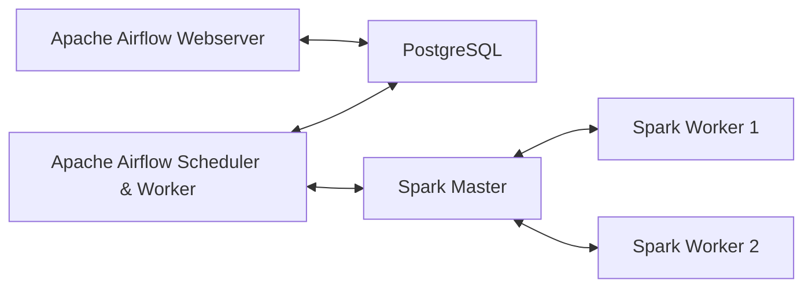

---

# Contenedores del proyecto

| Contenedor | Función |
|------------|----------|
| PostgreSQL | Base de datos de metadatos de Airflow |
| Airflow Init | Inicialización de la base de datos y creación del usuario administrador |
| Airflow Webserver | Interfaz gráfica de Apache Airflow |
| Airflow Scheduler | Programación y ejecución del DAG |
| Spark Master | Coordinación del clúster Spark y ejecución de la API REST |
| Spark Worker 1 | Procesamiento distribuido de tareas Spark |
| Spark Worker 2 | Procesamiento distribuido de tareas Spark |

---

# PostgreSQL

El contenedor PostgreSQL almacena toda la información interna de Apache Airflow.

Entre ella:

- DAGs registrados.
- Historial de ejecuciones.
- Estados de las tareas.
- Conexiones configuradas.
- Variables.
- Usuarios.

Configuración utilizada:

```text
PostgreSQL 16
```

---

# Airflow Init

Este contenedor se ejecuta una única vez.

Su función consiste en:

- Esperar a que PostgreSQL esté disponible.
- Inicializar la base de datos de Airflow.
- Ejecutar las migraciones.
- Crear el usuario administrador.

Una vez completada la inicialización, el contenedor deja de utilizarse.

---

# Airflow Webserver

Proporciona la interfaz web utilizada para administrar el pipeline.

Desde esta interfaz es posible:

- Ejecutar DAGs.
- Consultar Logs.
- Configurar conexiones.
- Visualizar el Graph View.
- Revisar el Grid View.
- Monitorear las ejecuciones.

El servicio queda disponible mediante:

```text
http://localhost:8088
```

---

# Airflow Scheduler

El Scheduler supervisa continuamente los DAGs registrados.

Entre sus responsabilidades se encuentran:

- Detectar nuevas ejecuciones.
- Lanzar tareas.
- Gestionar dependencias.
- Ejecutar Dynamic Task Mapping.
- Coordinar todo el flujo del pipeline.

---

# Spark Master

El Spark Master coordina todo el clúster Apache Spark.

Dentro de este contenedor también se ejecuta la API REST personalizada desarrollada para el proyecto.

La API escucha en:

```text
http://localhost:8000
```

Mientras que la interfaz del Spark Master se encuentra en:

```text
http://localhost:8080
```

---

# Spark Workers

El proyecto utiliza dos Workers.

```text
spark-worker-1

spark-worker-2
```

Cada Worker dispone de:

- 2 CPU Cores
- 4 GB de memoria

Los Workers reciben las tareas distribuidas enviadas por el Spark Master durante la ejecución de los distintos procesos de ingestión, transformación y agregación.

---

# Volúmenes compartidos

Los contenedores comparten distintos directorios mediante Docker Volumes.

```text
./app

↓

/opt/spark-app
```

Contiene todo el código fuente del proyecto.

---

```text
./data

↓

/opt/data
```

Almacena:

- Pre Raw
- Bronze
- Silver
- Gold
- Metadata

---

```text
./dags

↓

/opt/airflow/dags
```

Contiene los DAGs de Apache Airflow.

---

```text
./logs

↓

/opt/airflow/logs
```

Almacena los logs de ejecución de Airflow.

---

# Red de comunicación

Todos los contenedores pertenecen a la misma red creada automáticamente por Docker Compose.

Gracias a ello pueden comunicarse utilizando el nombre del servicio como hostname.

Por ejemplo:

```text
spark-master-chicago-crime
```

es utilizado por:

- Spark Workers.
- Apache Airflow.
- Spark API.

sin necesidad de utilizar direcciones IP.

---

# Levantar el proyecto

Una vez clonado el repositorio basta con ejecutar:

```bash
docker compose up -d
```

Posteriormente pueden verificarse los contenedores activos mediante:

```bash
docker ps
```

---

# Detener el proyecto

```bash
docker compose down
```

# Consideraciones de diseño

Se optó por una arquitectura basada en Docker Compose para facilitar la portabilidad y reproducibilidad del entorno de desarrollo.

La separación de responsabilidades entre Airflow, PostgreSQL y Apache Spark permite mantener una arquitectura modular, donde cada servicio cumple una función específica y puede evolucionar de forma independiente.

Además, el uso de volúmenes compartidos garantiza que tanto Airflow como Spark accedan al mismo código fuente y a los mismos datos, simplificando la orquestación del pipeline y evitando duplicidad de información.

# ⚙️ Configuración del proyecto

Una vez clonado el repositorio, es necesario realizar una serie de configuraciones antes de ejecutar el pipeline.

---

# 1. Clonar el repositorio

```bash
git clone https://github.com/TU_USUARIO/TU_REPOSITORIO.git

cd TU_REPOSITORIO
```

---

# 2. Iniciar los contenedores

Levantar todos los servicios definidos en `docker-compose.yml`.

```bash
docker compose up -d
```

Verificar que todos los contenedores se encuentren ejecutándose.

```bash
docker ps
```

Deberían aparecer los siguientes servicios:

- airflow-postgres-chicago-crime
- airflow-webserver-chicago-crime
- airflow-scheduler-chicago-crime
- airflow-init-chicago-crime
- spark-master-chicago-crime
- spark-worker-1-chicago-crime
- spark-worker-2-chicago-crime

---

# 3. Acceder a Apache Airflow

Abrir el navegador.

```text
http://localhost:8088
```

Credenciales por defecto:

| Usuario | Contraseña |
|----------|------------|
| airflow | airflow |

> Estas credenciales son creadas automáticamente por el contenedor `airflow-init`.

---

# 4. Configurar la conexión del FileSensor

Ir a:

```text
Admin

↓

Connections
```

Crear una nueva conexión con la siguiente configuración.

| Campo | Valor |
|--------|-------|
| Connection Id | pre_raw_fs |
| Connection Type | File (Path) |
| Path | /opt/data/pre-raw |

Esta conexión será utilizada por el `FileSensor` para detectar nuevos archivos CSV.

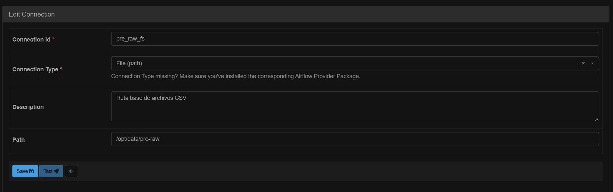

---

# 5. Configurar la conexión HTTP

Crear una segunda conexión.

| Campo | Valor |
|--------|-------|
| Connection Id | spark_api |
| Connection Type | HTTP |
| Host | spark-master-chicago-crime |
| Port | 8000 |

Esta conexión permite que Airflow envíe solicitudes HTTP hacia la API REST desplegada en el Spark Master.

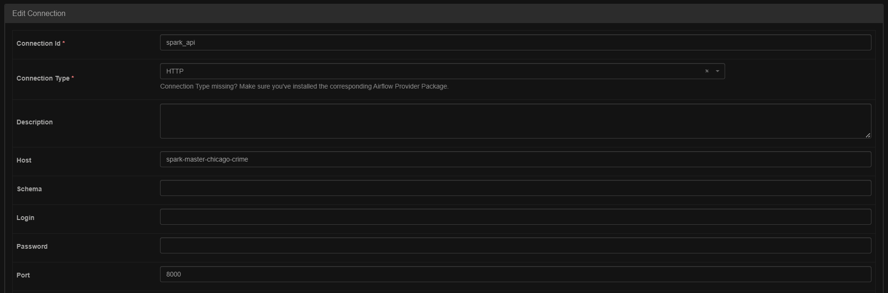

---

# 6. Configurar la conexión con Google Cloud

Crear una tercera conexión.

| Campo | Valor |
|--------|-------|
| Connection Id | gcs_connection_chicago_crime |
| Connection Type | Google Cloud |

En esta conexión deberán configurarse las credenciales correspondientes a la cuenta de servicio con permisos sobre el Bucket de Google Cloud Storage.

La autenticación puede realizarse utilizando un archivo JSON de Service Account o cualquier otro método soportado por Apache Airflow.

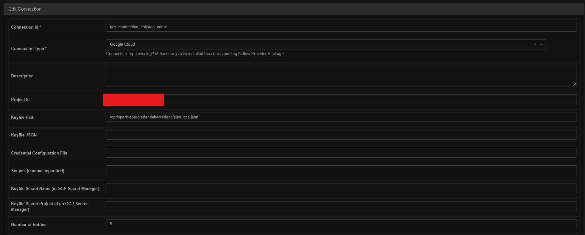

---

# 7. Crear el Bucket de Google Cloud Storage

Crear un Bucket en Google Cloud Storage.

Ejemplo:

```text
crime-chicago-bucket
```

Este nombre debe coincidir con el utilizado dentro del DAG.

```python
bucket_name = "crime-chicago-bucket"
```

---

# 8. Descargar el dataset

El dataset original no se incluye en este repositorio debido a su tamaño (más de **8 millones de registros**).

Una vez descargado, copiar los archivos CSV dentro de:

```text
data/

└── pre-raw/

    └── pending/
```

---

# 9. Ejecutar el DAG

Ingresar a Apache Airflow.

Habilitar el DAG.

```text
chicago_crime_dag
```

Ejecutarlo manualmente mediante:

```text
Trigger DAG
```

Durante el desarrollo el DAG permanece configurado como:

```python
schedule = None
```

para facilitar las pruebas.

En un entorno productivo se recomienda utilizar una programación diaria, por ejemplo:

```python
schedule = "0 9 * * *"
```

lo que ejecutará el pipeline automáticamente todos los días a las **09:00 AM**.

---

# 10. Resultado esperado

Al finalizar correctamente la ejecución del pipeline se obtendrá la siguiente estructura.

```text
pre-raw/

├── pending/

└── processed/

bronze_level/

silver_level/

gold_level/

metadata/
```

Además:

- Los archivos CSV habrán sido movidos a `processed/`.
- La tabla de control tendrá todos los estados actualizados.
- Las tablas agregadas estarán disponibles en `gold_level/`.
- El contenido de la capa Gold habrá sido publicado en Google Cloud Storage.

---

# Verificación rápida

Antes de ejecutar el proyecto, verificar que se cumpla la siguiente lista.

- Docker Desktop en ejecución.
- Todos los contenedores iniciados.
- Airflow accesible desde el navegador.
- Spark Master disponible.
- Conexión `pre_raw_fs` creada.
- Conexión `spark_api` creada.
- Conexión `gcs_connection_chicago_crime` creada.
- Dataset copiado en `pre-raw/pending`.
- Bucket de Google Cloud Storage creado.
- DAG habilitado en Airflow.

Con esta configuración, el pipeline quedará listo para ejecutarse de forma completamente automatizada.

# 🚀 Mejoras futuras (Roadmap)

Aunque el pipeline implementado cumple con el objetivo de construir una arquitectura Medallion completamente funcional utilizando Apache Spark, Apache Airflow y Google Cloud Storage, existen diversas oportunidades de mejora para acercarlo aún más a un entorno de producción.

---

## Implementar Delta Lake

Actualmente las capas Bronze, Silver y Gold almacenan la información en formato Parquet.

Como mejora futura se plantea migrar el almacenamiento a **Delta Lake**, permitiendo aprovechar funcionalidades como:

- Transacciones ACID.
- Time Travel.
- Schema Evolution.
- Upserts mediante `MERGE`.
- Mejor rendimiento en consultas.
- Compactación automática de archivos.

---
## Optimización del particionamiento

Actualmente Bronze y Silver se encuentran particionadas únicamente por:

```text
Year
```

Dependiendo del patrón de consultas, podría evaluarse un particionamiento adicional utilizando columnas como:

- Primary Type
- District
- Community Area

con el objetivo de mejorar el rendimiento de lectura.

---

## Incorporar pruebas automáticas

El proyecto puede fortalecerse incorporando pruebas unitarias e integrales para validar cada etapa del pipeline.

Por ejemplo:

- Validación del esquema de entrada.
- Verificación del número de registros procesados.
- Pruebas de calidad de datos.
- Validación de indicadores generados.
- Pruebas de la API REST.

---

# Lecciones aprendidas

Durante el desarrollo de este proyecto fue posible profundizar en diferentes conceptos relacionados con la Ingeniería de Datos, entre ellos:

- Diseño de una arquitectura Medallion.
- Procesamiento distribuido con Apache Spark.
- Optimización mediante particionamiento y Broadcast Join.
- Orquestación de pipelines con Apache Airflow.
- Dynamic Task Mapping.
- Comunicación entre servicios mediante APIs REST.
- Gestión incremental utilizando tablas de control.
- Contenerización con Docker Compose.
- Integración con Google Cloud Storage.
- Construcción de pipelines escalables y desacoplados.

---

# Autor

**Jean Edinson**

Si este proyecto te resultó interesante o tienes alguna sugerencia de mejora, no dudes en abrir un **Issue** o enviar un **Pull Request**.

¡Toda contribución es bienvenida!
